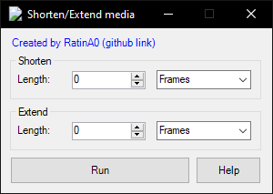

# ShortenExtendMedia

Vegas Pro script for shortening or extending the selected media (text, video, audio, etc)

### Info:

- Decreasing the length of the selected objects (Shorten)

- Increase the length of the selected objects (Extend)

(!) The Composite/FX Keyframes will NOT move if you change the events with this.

Viddeo: https://www.youtube.com/watch?v=z_W8w6uBasw

### Download:

Releases: https://github.com/RatinA0/ShortenExtendMedia/releases

`ShortenExtendMedia13.dll` for SONY Vegas Pro 13 and below

`ShortenExtendMedia14.dll` for MAGIX Vegas Pro 14 and above

### Run

Place the file in: `...\vegas install folder\Script Menu` or `...\Documents\Vegas Script Menu`

Run from Vegas: Tools -> Scripting -> Rescan Script Menu Folder -> Click the script

Add to the toolbar: Options -> Customize Toolbar

### Build

Import the correct reference:

Project -> Add reference -> Browse -> Your VEGAS install folder ->

- `ScriptPortal.Vegas.dll` for SONY Vegas Pro 13 and below

- `Sony.Vegas.dll` for MAGIX Vegas Pro 14 and above
